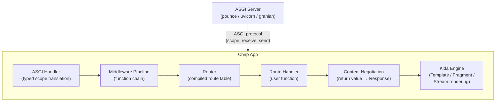
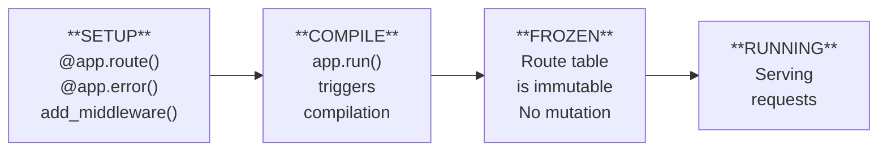
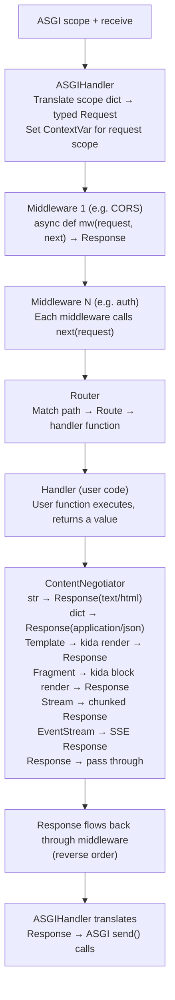
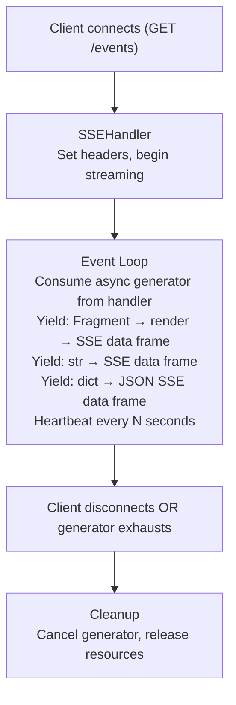
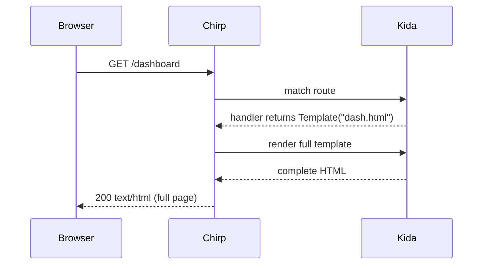
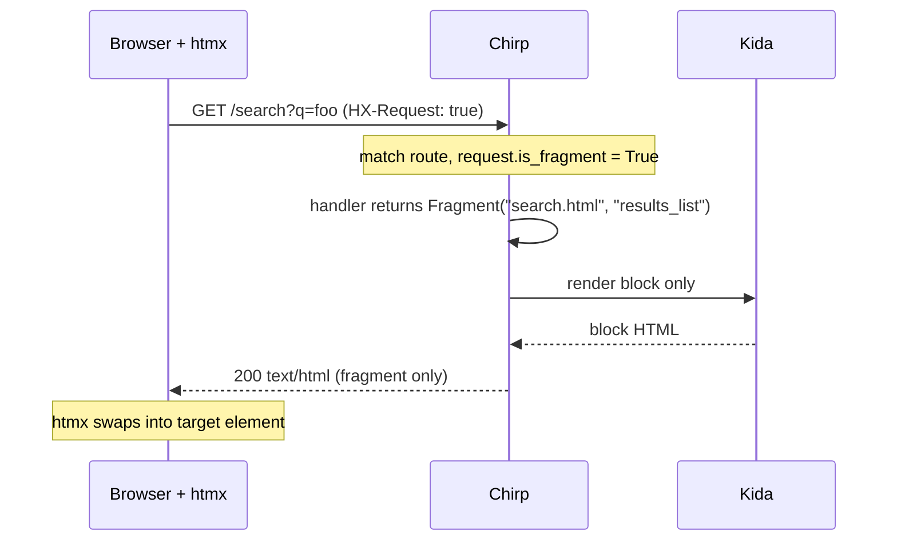
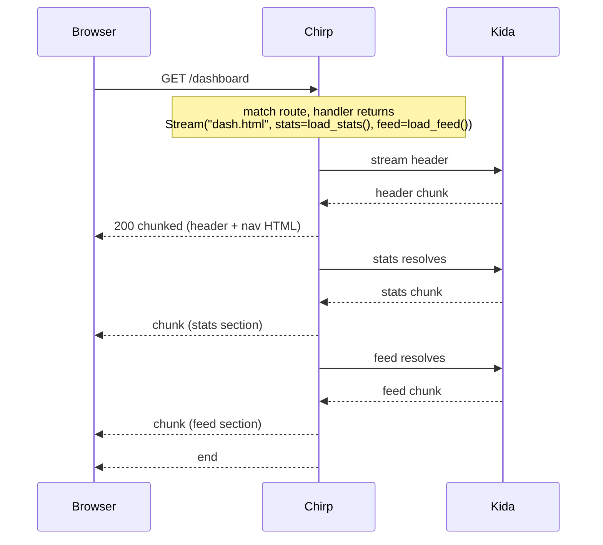
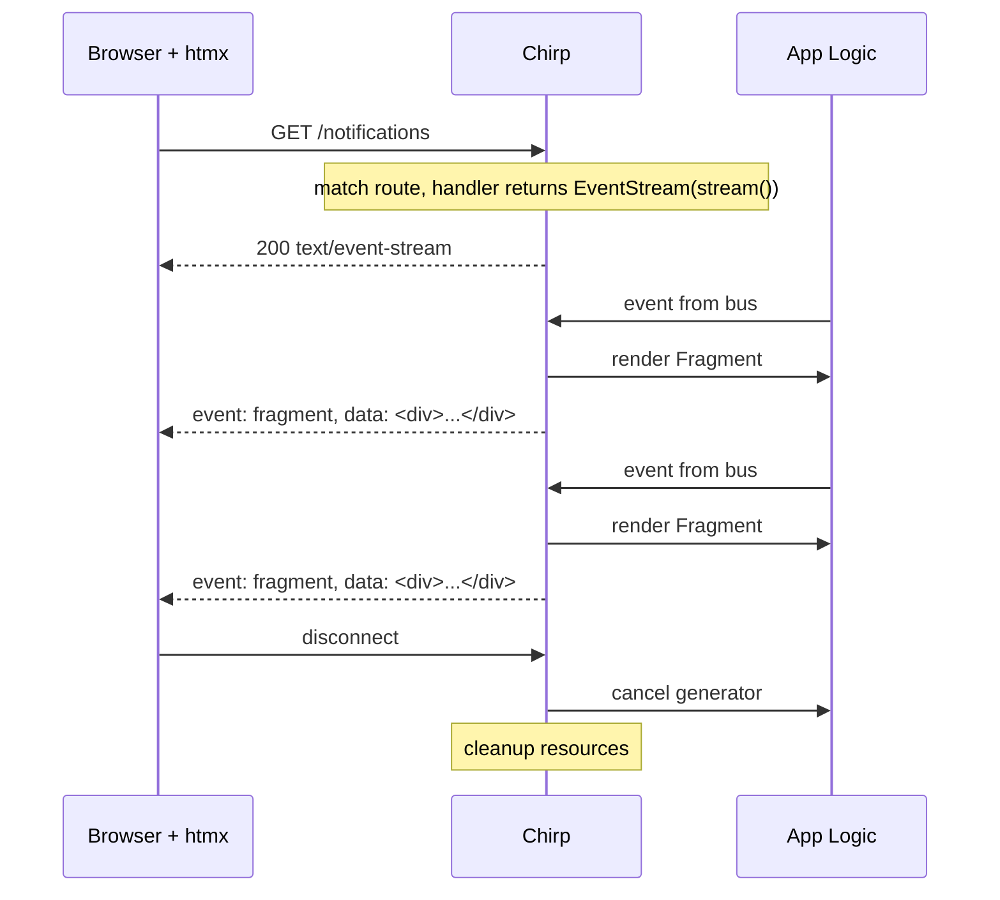
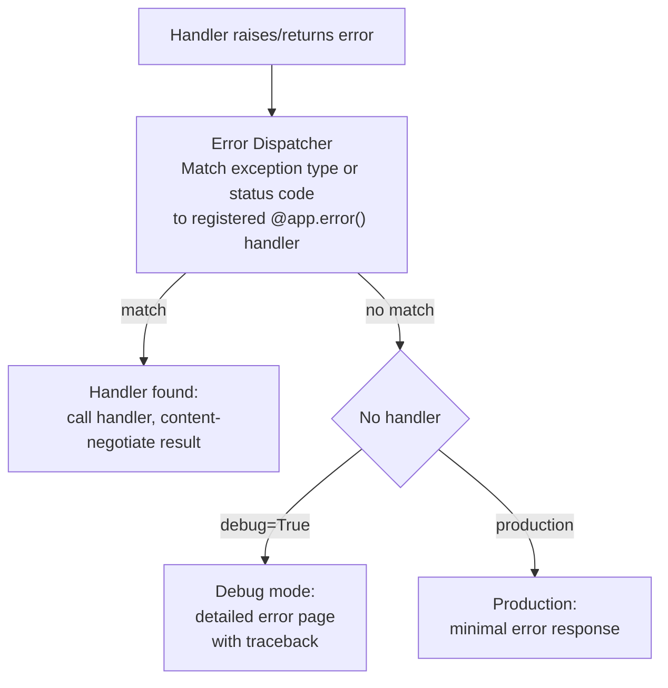

# Architecture Design Document: Chirp

**Version**: 0.3.0
**Date**: 2026-02-07
**Status**: Active (Phases 0-7 implemented, documentation site pending)

---

## 1. Architectural Goals

1. **HTML-over-the-wire first.** Every architectural decision optimizes for serving HTML --
   full pages, fragments, streams, and real-time events.

2. **Free-threading by construction.** Data races are impossible by design, not prevented
   by testing. Immutable data, ContextVar isolation, no shared mutable state.

3. **Typed end-to-end.** Zero `type: ignore` comments. Every public API has complete type
   annotations. The type checker (`ty`) is a first-class development tool.

4. **Minimal dependency surface.** Two core dependencies (kida, anyio). Everything else is
   optional. The framework owns its HTTP abstractions.

5. **Transparent control flow.** A request enters the ASGI handler, passes through
   middleware, reaches a route handler, returns a value, and that value becomes a response.
   No magic proxies, no implicit global state, no action-at-a-distance.

---

## 2. System Context



---

## 3. Layer Architecture

Chirp is organized into three layers with strict dependency direction: surface depends on
core, core depends on engine. No upward dependencies. No circular imports.

### 3.1 Surface Layer

**Purpose:** Developer-facing API. What users import and interact with.

**Components:**
- `App` -- Application class with decorator registration
- `AppConfig` -- Frozen configuration dataclass
- Return types: `Template`, `Fragment`, `Stream`, `EventStream`, `Response`, `Redirect`
- Decorators: `@app.route()`, `@app.error()`, `@app.template_filter()`

**Constraints:**
- No ASGI types visible at this layer
- No internal implementation details exposed
- All types are re-exported from `chirp.__init__`

### 3.2 Core Layer

**Purpose:** HTTP abstractions, routing, middleware protocol. The framework's internal model.

**Components:**
- `Request` -- Frozen dataclass with typed attributes
- `Response` -- Chainable transformation object
- `Headers`, `QueryParams` -- Immutable collections
- `Router` -- Compiled route table
- `Route` -- Frozen route definition
- `Middleware` -- Protocol definition

**Constraints:**
- No I/O in this layer (pure data and logic)
- All data structures are immutable or produce immutable results
- No dependency on kida (templating is in the engine layer)

### 3.3 Engine Layer

**Purpose:** ASGI integration, template rendering, SSE protocol, dev server.

**Components:**
- `ASGIHandler` -- Translates ASGI scope/messages to/from chirp types
- `KidaIntegration` -- Environment setup, rendering dispatch
- `SSEHandler` -- Server-Sent Events protocol implementation
- `DevServer` -- Development server with auto-reload
- `ContentNegotiator` -- Maps return values to Response objects

**Constraints:**
- Only layer that touches ASGI directly
- Only layer that calls kida
- Only layer that performs I/O

---

## 4. Component Design

### 4.1 App Lifecycle



**Setup phase** (mutable): Decorators register routes, error handlers, middleware, template
filters. The app accumulates configuration into mutable lists.

**Compile phase** (transition): On `app.run()`, the app compiles registered routes into an
optimized route table, freezes the middleware pipeline, initializes the kida environment, and
validates configuration.

**Frozen phase** (immutable): The compiled app state is immutable. The route table, middleware
chain, kida environment, and config cannot change. This is the state that serves requests.

**Running phase** (active): The ASGI server calls the app. Each request flows through the
frozen pipeline. Request-scoped state uses ContextVar, never shared mutable state.

### 4.2 Request Flow



### 4.3 Router Design

**Compile-time optimization:** Routes registered during setup are compiled into a lookup
structure when the app freezes. The compiler:

1. Parses path patterns into segments (static, parameter, wildcard)
2. Groups routes by HTTP method
3. Builds a prefix tree (trie) for O(path-depth) matching
4. Extracts parameter converters (str, int, float, path)
5. Produces a frozen `CompiledRouter` that cannot be modified

**Match result:**

```python
@dataclass(frozen=True, slots=True)
class RouteMatch:
    route: Route
    path_params: dict[str, str]
    # Converted params are produced by the handler dispatcher
```

**No match:** Returns a 404 through the error handler system. The detail message includes the
HTTP method and path (e.g., `"No route matches GET '/foo'"`). Method not allowed returns 405
with an `Allow` header listing valid methods and the allowed methods embedded in the detail
message body (e.g., `"Method 'POST' not allowed. Allowed: GET, HEAD"`).

### 4.4 Middleware Pipeline

**Protocol:**

```python
type AnyResponse = Response | StreamingResponse | SSEResponse

class Middleware(Protocol):
    async def __call__(self, request: Request, next: Next) -> AnyResponse: ...

# Where Next is:
type Next = Callable[[Request], Awaitable[AnyResponse]]
```

All three response types support chainable `.with_status()`, `.with_header()`, `.with_headers()`,
and `.with_content_type()` methods. `StreamingResponse` uses `dataclasses.replace` for immutability.
`SSEResponse` provides no-op versions since SSE headers are fixed by the protocol.

**Execution model:** Middleware forms a chain. Each middleware receives the request and a
`next` function. Calling `next(request)` passes control to the next middleware (or the route
handler if it's the last one). The response flows back through the chain in reverse order.

```python
# Conceptual execution:
async def execute(request, middlewares, handler):
    async def chain(i, req):
        if i == len(middlewares):
            return await handler(req)
        return await middlewares[i](req, lambda r: chain(i + 1, r))
    return await chain(0, request)
```

**Compilation:** The middleware chain is built at freeze time. The list of middleware
functions is captured as a tuple. No middleware can be added after `app.run()`.

**Built-in middleware (all implemented):**

| Middleware | Module | Purpose |
|------------|--------|---------|
| `CORSMiddleware` | `middleware.builtin` | Cross-Origin Resource Sharing (preflight, credentials, expose-headers) |
| `StaticFiles` | `middleware.static` | Serve static files with MIME detection and path traversal protection |
| `SessionMiddleware` | `middleware.sessions` | Signed cookie sessions via optional `itsdangerous` dependency |

**Request-scoped context (implemented):**

The handler pipeline sets a `ContextVar` (`request_var`) before dispatch and resets it in a
`finally` block. A mutable namespace (`g`) is also available per-request, inspired by Flask
but backed by ContextVar for free-threading safety. Both are reset after each request.

```python
from chirp.context import get_request, g

# In middleware:
g.user = authenticate(request)

# In handler:
user = g.user
```

### 4.5 Content Negotiation

The `ContentNegotiator` maps return values to `Response` objects. It uses `isinstance`
checks on the return value:

| Return Type | Action |
|-------------|--------|
| `str` | `Response(body=value, content_type="text/html")` |
| `bytes` | `Response(body=value, content_type="application/octet-stream")` |
| `dict` / `list` | JSON serialize, `Response(content_type="application/json")` |
| `Response` | Pass through unchanged |
| `Redirect` | `Response(status=302, headers={"Location": url})` |
| `Template` | Render via kida, `Response(content_type="text/html")` |
| `Fragment` | Render block via kida, `Response(content_type="text/html")` |
| `Stream` | kida `render_stream()` → `StreamingResponse` → chunked ASGI |
| `EventStream` | `SSEResponse` → `handle_sse` (event producer + disconnect monitor) |
| `tuple[value, int]` | Content-negotiate the value, override status |
| `tuple[value, int, dict]` | Content-negotiate the value, override status and headers |

### 4.6 Template Integration

**Environment lifecycle:**
1. App freeze triggers kida `Environment` creation
2. `AppConfig.template_dir` sets the `FileSystemLoader` path
3. `auto_reload=config.debug` enables template reloading in development, caching in production
4. Registered filters and globals are added to the environment
5. The environment is stored on the frozen app (immutable after creation)
6. Each render call uses the shared environment (kida is thread-safe)

**Rendering dispatch:**

```python
# Template: full page render
async def render_template(env, template: Template) -> str:
    tmpl = env.get_template(template.name)
    return tmpl.render(**template.context)

# Fragment: block-level render
async def render_fragment(env, fragment: Fragment) -> str:
    tmpl = env.get_template(fragment.template_name)
    return tmpl.render_block(fragment.block_name, **fragment.context)

# Stream: progressive render (yields chunks via generator)
def render_stream(env, stream: Stream) -> Iterator[str]:
    tmpl = env.get_template(stream.template_name)
    return tmpl.render_stream(**stream.context)
```

**Kida status (verified v0.1.3-dev):**
- `render()` -- StringBuilder pattern (fastest, default)
- `render_block()` -- blocks compiled as independent functions
- `render_stream()` -- generator pattern, yields at every statement boundary; dual-mode
  compiler generates both functions from each template in a single compilation pass

### 4.7 SSE Architecture

**Protocol implementation:**

```
HTTP/1.1 200 OK
Content-Type: text/event-stream
Cache-Control: no-cache
Connection: keep-alive

event: fragment
data: <div class="notification">New message</div>

event: fragment
data: <div class="notification">User joined</div>

: heartbeat
```

**Connection lifecycle:**



**Disconnect detection:** The ASGI `receive` channel signals client disconnection via
`http.disconnect`. The SSE handler launches a dedicated disconnect monitor task that awaits
this message and cancels the event producer task. Event generator cleanup runs automatically
via task cancellation.

**Event formatting:** `_format_event()` handles multiple yield types:
- `SSEEvent` → full SSE wire format with optional `event:`, `id:`, `retry:` fields
- `Fragment` → rendered via kida, sent as `event: fragment\ndata: <html>...`
- `str` → sent as `data: <string>`
- `dict` → JSON-serialized, sent as `data: {"json": ...}`

**Response type:** `SSEResponse` is dispatched directly by the ASGI handler (bypasses
`_send_response`). Its `.with_*()` methods are no-ops since SSE headers are fixed by
the protocol (`text/event-stream`, `no-cache`, `keep-alive`).

---

## 5. Data Flow Patterns

### 5.1 Full Page Request



### 5.2 Fragment Request (htmx)



### 5.3 Streaming HTML



### 5.4 Server-Sent Events



---

## 6. Thread Safety Architecture

### 6.1 Immutability Categories

| Component | Mutability | Phase | Mechanism |
|-----------|-----------|-------|-----------|
| AppConfig | Immutable | Always | `@dataclass(frozen=True, slots=True)` |
| Route | Immutable | Always | `@dataclass(frozen=True, slots=True)` |
| CompiledRouter | Immutable | After freeze | Frozen data structures |
| Middleware chain | Immutable | After freeze | Captured as tuple |
| Kida Environment | Immutable | After freeze | Copy-on-write internals |
| Request | Immutable | Always | `@dataclass(frozen=True, slots=True)` |
| Response | Transformation | Per-chain | `.with_*()` returns new object |
| Headers | Immutable | Always | Immutable mapping |
| QueryParams | Immutable | Always | Immutable mapping |

### 6.2 Request-Scoped State

```python
from contextvars import ContextVar

# Framework-managed context
_request_ctx: ContextVar[Request] = ContextVar("chirp.request")
_app_ctx: ContextVar[App] = ContextVar("chirp.app")

# User-extensible context (e.g., auth middleware sets current user)
_user_ctx: ContextVar[Any] = ContextVar("chirp.user")
```

Each ASGI request sets ContextVar tokens at entry and resets them on exit. ContextVar is
free-threading safe -- each thread/task gets its own value without locking.

### 6.3 What Has No Locks

- Route matching (reads immutable trie)
- Template rendering (kida is thread-safe)
- Content negotiation (pure function)
- Response construction (each `.with_*()` produces a new object)
- Header/query param access (immutable collections)

### 6.4 What Needs Care

- **App freeze transition**: Under free-threading, multiple ASGI worker threads could call
  `App.__call__()` concurrently on first request. The freeze uses a `threading.Lock` with
  double-check locking: fast path reads `_frozen` without locking, slow path acquires the
  lock and checks again before compiling. After `_frozen = True`, the lock is never
  contended again. `app.run()` freezes eagerly before the ASGI server starts.
- **Dev server auto-reload**: Rebuilds the app on file change. The old app serves requests
  until the new one is compiled and swapped atomically.
- **SSE connection tracking**: If a central registry of active SSE connections is needed,
  it must use a lock-protected data structure. Prefer per-handler tracking via ContextVar
  and anyio task groups instead.

---

## 7. Error Handling Architecture

### 7.1 Error Flow



### 7.2 Error Handler Resolution

Error handlers are matched in specificity order:

1. Exact exception class match (e.g., `@app.error(ValidationError)`)
2. Exception parent class match (walks MRO)
3. HTTP status code match (e.g., `@app.error(404)`)
4. Default handler (built-in)

### 7.3 Mid-Stream Errors

Streaming HTML and SSE have special error handling needs because headers are already sent:

- **Streaming HTML**: If an error occurs after the first chunk, emit an error comment
  (`<!-- chirp: render error -->`) and close the stream. The browser receives partial
  content. In debug mode, emit the traceback as an HTML comment.
- **SSE**: Emit an `event: error` with the error details as data. The client can handle
  this via htmx's `sse-error` event or custom JavaScript.

---

## 8. Module Dependency Graph

```
    chirp/__init__.py  (re-exports public API)
           │
           ├── chirp/app.py
           │      ├── chirp/config.py
           │      ├── chirp/routing/
           │      ├── chirp/middleware/protocol.py
           │      └── chirp/templating/integration.py
           │
           ├── chirp/http/
           │      ├── request.py     (no internal deps)
           │      ├── response.py    (depends on headers.py)
           │      ├── headers.py     (no internal deps)
           │      └── cookies.py     (no internal deps)
           │
           ├── chirp/routing/
           │      ├── router.py      (depends on route.py, params.py)
           │      ├── route.py       (depends on http/)
           │      └── params.py      (no internal deps)
           │
           ├── chirp/middleware/
           │      ├── protocol.py    (depends on http/)
           │      └── builtin.py     (depends on protocol.py, http/)
           │
           ├── chirp/templating/
           │      ├── integration.py (depends on config.py; external: kida)
           │      ├── returns.py     (no internal deps)
           │      └── filters.py     (depends on integration.py)
           │
           ├── chirp/realtime/
           │      ├── sse.py         (depends on http/)
           │      └── events.py      (depends on templating/returns.py)
           │
           ├── chirp/server/
           │      ├── handler.py     (depends on http/, routing/, middleware/, realtime/)
           │      ├── negotiation.py (depends on http/, templating/; external: kida)
           │      └── dev.py         (external: pounce)
           │
           └── chirp/_internal/
                  └── asgi.py        (no internal deps; ASGI type definitions)
```

**Key constraint:** `chirp/http/` has no internal dependencies. It can be tested and
reasoned about in complete isolation.

---

## 9. External Integration Points

### 9.1 ASGI Server Interface

Chirp exposes a standard ASGI 3.0 callable:

```python
app = App()
# ... register routes ...

# For ASGI servers:
# pounce app:app       (recommended -- same ecosystem, free-threading native)
# uvicorn app:app
# granian app:app

# The App.__call__ method implements:
async def __call__(self, scope: Scope, receive: Receive, send: Send) -> None: ...
```

### 9.2 Kida Template Engine

Chirp creates and owns a kida `Environment` instance:

```python
from kida import Environment, FileSystemLoader

env = Environment(
    loader=FileSystemLoader(config.template_dir),
    autoescape=True,
    auto_reload=config.debug,
)
```

Required kida capabilities (all integrated as of Phase 6 completion):
- `Environment.get_template()` -- ✅ integrated via `templating/integration.py`
- `Template.render()` -- ✅ integrated, used by `Template` return type
- `Template.render_block()` -- ✅ integrated, used by `Fragment` return type
- `Template.render_stream()` -- ✅ integrated, used by `Stream` return type (kida dual-mode compiler generates both StringBuilder and generator functions per template)

### 9.3 anyio Async Runtime

Used for:
- `anyio.to_thread.run_sync()` -- running sync handlers in thread pool
- `anyio.create_task_group()` -- concurrent template section resolution
- `anyio.CancelScope` -- SSE disconnect handling
- `anyio.Event` -- coordination between ASGI handler and response sender

---

## 10. Decisions and Trade-offs

### 10.1 ASGI-Only (No WSGI)

**Decision:** Chirp does not support WSGI.

**Rationale:** WSGI is synchronous and cannot support streaming HTML, SSE, or efficient
concurrent request handling. Supporting both would compromise the architecture. ASGI is the
standard for async Python web applications.

**Trade-off:** Cannot deploy on pure-WSGI hosts (increasingly rare in 2026).

### 10.2 Kida-Only Templates (No Jinja2 Option)

**Decision:** Chirp uses kida exclusively. No template engine abstraction layer.

**Rationale:** Fragment rendering and streaming HTML require deep template engine integration.
An abstraction layer would either limit features or require every engine to implement the
same block-rendering API. Since chirp's author also owns kida, tight integration is a
strength, not a coupling problem.

**Trade-off:** Users who prefer Jinja2 or Mako must use kida or choose a different framework.

### 10.3 Return Values Over Response Construction

**Decision:** Route handlers return values (str, dict, Template, etc.) instead of
constructing Response objects.

**Rationale:** Reduces boilerplate, makes intent clear from the return type, enables the
framework to handle content negotiation consistently. Explicit `Response` objects are still
available for full control.

**Trade-off:** Slight magic in the content negotiation layer. Mitigated by clear
documentation and predictable isinstance-based dispatch.

### 10.4 Function Middleware Over ASGI Wrapping

**Decision:** Middleware operates on `(Request, Next) -> Response`, not on raw ASGI
`(scope, receive, send)`.

**Rationale:** Higher-level API is more ergonomic for 95% of middleware use cases. ASGI-level
access is available through custom ASGI middleware wrapping the app directly (escape hatch).

**Trade-off:** Cannot intercept at the ASGI level (e.g., modifying scope before request
parsing). Rare use case, and the escape hatch covers it.

### 10.5 anyio Over Raw asyncio

**Decision:** Use anyio for async primitives instead of asyncio directly.

**Rationale:** anyio provides structured concurrency, backend-agnostic async (asyncio and
trio), and better cancellation semantics. It's also what Starlette uses, ensuring
compatibility with the broader ASGI ecosystem.

**Trade-off:** Additional dependency (~100KB). Acceptable given the value.

---

## 11. Security Considerations

### 11.1 Input Handling

- **Path parameters:** Type-converted during routing. Invalid types produce 404, not 500.
- **Query parameters:** Accessed via immutable `QueryParams`. No mutation possible.
- **Headers:** Immutable `Headers` object. No injection via mutation.
- **Body parsing:** Delegated to python-multipart (optional) for form data. JSON parsing
  uses stdlib `json` module.
- **Template rendering:** Kida autoescape is enabled by default. XSS protection is built in.

### 11.2 Session Security

- Sessions use itsdangerous (optional) for signed cookies.
- No server-side session storage in core (stateless by default).
- Session middleware validates signatures on every request.
- Expired/tampered sessions produce empty session objects, not errors.

### 11.3 CORS

- Built-in CORS middleware with explicit origin allowlists.
- No wildcard origins in production mode by default.
- Preflight caching configured via `max_age`.

---

## 12. Observability

### 12.1 Logging

- Request lifecycle events logged at DEBUG level.
- Route matching logged at DEBUG level.
- Error handling logged at ERROR level with traceback.
- No structured logging in core (users choose their logging setup).

### 12.2 Metrics Hooks

- Middleware is the extension point for metrics.
- The timing middleware pattern (shown in middleware examples) is the recommended approach.
- No built-in metrics library dependency.

### 12.3 Debug Mode

- Detailed error pages with traceback (kida-rendered).
- Template auto-reload enabled.
- Request/response logging at INFO level.
- No production data exposure safeguards needed (debug mode is opt-in).
