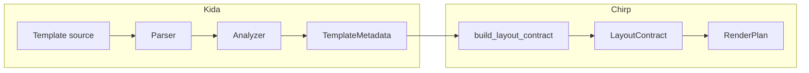

# Plan: Showcase Chirp's Use of Kida's AST (Regions, OOB, Metadata)

## Goal

Make Chirp's AST-driven integration with Kida visible and understandable — so developers see why Chirp + Kida enables declarative OOB regions, block validation, and zero-duplication patterns without hard-coded logic.

---

## Background

### Current Usage (Undocumented)

Chirp already uses Kida's `template_metadata()` in several places:

| Location | What it does |
|----------|--------------|
| `render_plan.py` → `_oob_block_names()` | Discovers `*_oob` blocks from `meta.blocks` |
| `render_plan.py` → `build_layout_contract()` | Extracts `cache_scope`, `depends_on` per block for `LayoutContract` |
| `render_plan.py` → `_validate_view_ref()` | Validates block exists before render |

### Kida Metadata Available

- **TemplateMetadata**: `name`, `extends`, `blocks`, `top_level_depends_on`
- **BlockMetadata** (per block): `is_region`, `region_params`, `depends_on`, `cache_scope`, `is_pure`, `emits_html`, `inferred_role`, `block_hash`

### Current Documentation Gaps

- Fragments doc explains `Fragment`/`Page`/`OOB` but not *how* Chirp knows blocks exist
- Architecture mentions "Kida environment" but not AST/metadata
- App shell guide shows OOB pattern but not the discovery mechanism
- No cross-link from Kida docs to Chirp as a consumer

---

## Scope

### In Scope

1. **Fragments doc** — Add "How Chirp finds blocks" subsection
2. **Kida integration doc** — New page under `docs/about/` or `docs/templates/`
3. **Architecture diagram** — Add AST → metadata → LayoutContract flow
4. **Use `meta.regions()`** — Code change in `render_plan.py` to use regions explicitly
5. **Example introspection** — Debug flag or comments in shell_oob
6. **Blog post** — "Chirp + Kida: AST-Driven Partial Rendering" (lbliii)
7. **Kida docs** — Add Chirp as integration/consumer case study

### Out of Scope

- Changing the public API of `template_metadata()` or `LayoutContract`
- Adding new metadata fields to Kida
- Caching implementation (depends_on/cache_scope are already used for contract; actual caching is future work)

---

## Tasks

### Phase 1: Documentation (Low Risk)

| # | Task | File(s) | Effort |
|---|------|---------|--------|
| 1.1 | Add "How Chirp finds blocks" subsection to Fragments doc | `site/content/docs/templates/fragments.md` | S |
| 1.2 | Create "Kida Integration" doc | `site/content/docs/templates/kida-integration.md` (or `about/kida-integration.md`) | M |
| 1.3 | Add AST flow diagram to Architecture doc | `site/content/docs/about/architecture.md` | S |
| 1.4 | Add `kida-integration` to templates index / about index | `site/content/docs/templates/_index.md`, `about/_index.md` | XS |

### Phase 2: Code (Small Change)

| # | Task | File(s) | Effort |
|---|------|---------|--------|
| 2.1 | Use `meta.regions()` when available for OOB discovery | `src/chirp/templating/render_plan.py` | S |
| 2.2 | Add `--show-metadata` or debug endpoint to shell_oob example | `examples/shell_oob/` | S |

### Phase 3: Cross-Project

| # | Task | File(s) | Effort |
|---|------|---------|--------|
| 3.1 | Blog post: "Chirp + Kida: AST-Driven Partial Rendering" | `lbliii/blog/content/posts/` | M |
| 3.2 | Kida docs: Add "Integrations" or "Consumers" section with Chirp case study | `kida/site/content/` | M |

---

## Task Details

### 1.1 Fragments doc — "How Chirp finds blocks"

**Location**: After "Block Availability" section in `fragments.md`

**Content** (draft):

```markdown
## How Chirp Finds Blocks

Chirp uses Kida's `template_metadata()` to introspect templates at build time.
Block names, regions, and dependencies come from the AST — Chirp never hard-codes
which blocks exist. That enables:

- **Validation** — `fragment_block` and `page_block` are checked before render
- **OOB discovery** — Blocks named `*_oob` are discovered automatically for app shells
- **Layout contracts** — `depends_on` and `cache_scope` from each block drive
  when OOB regions are rendered

See [Kida Integration](kida-integration) for the full flow.
```

### 1.2 Kida Integration doc

**Sections**:

1. **Overview** — `template_metadata()` as the bridge
2. **OOB discovery** — `build_layout_contract()`, `*_oob` convention, `LayoutContract`
3. **Block validation** — `_validate_view_ref()`, `validate_blocks`
4. **Regions** — `` compiles to block + callable; `is_region`, `region_params`
5. **Metadata fields used** — Table: BlockMetadata field → Chirp use
6. **Diagram** — Template → Parser → AST → Analyzer → TemplateMetadata → Chirp

### 1.3 Architecture diagram

**Add to** `architecture.md` after "Request Flow" or in a new "Template Rendering" subsection:



### 2.1 Use `meta.regions()` for OOB discovery

**Current** (`_oob_block_names`):

```python
blocks = getattr(meta, "blocks", None)
return {b for b in blocks if b.endswith(OOB_BLOCK_SUFFIX)}
```

**Proposed**: Prefer `meta.regions()` when available (returns blocks with `is_region=True`), intersect with `*_oob` suffix. Fallback to current behavior if `regions()` not present (e.g. Jinja2 adapter).

**Note**: Kida's `TemplateMetadata.regions()` returns `dict[str, BlockMetadata]` (blocks with `is_region=True`). Filter by `*_oob` suffix: `{k for k in meta.regions() if k.endswith(OOB_BLOCK_SUFFIX)}`.

### 2.2 Example introspection

**Options** (pick one):

- **A**: Add `?debug=metadata` query param to shell_oob that returns JSON of `template_metadata()` for the layout
- **B**: Add `--show-metadata` CLI flag to the example app
- **C**: Add inline comments in `_layout.html` showing the metadata Chirp uses (e.g. `{# Chirp discovers sidebar_oob via template_metadata().blocks #}`)

**Recommendation**: C is simplest; A is most interactive.

### 3.1 Blog post outline

1. **Hook** — "Chirp doesn't hard-code which blocks to render as OOB. It asks the template."
2. **Flow** — Template → AST → TemplateMetadata → LayoutContract
3. **Regions** — One definition, two uses (slot + OOB)
4. **Metadata in action** — `depends_on`, `cache_scope`, `is_region`
5. **Why it matters** — Declarative, extensible, type-safe

### 3.2 Kida docs — Integrations section

**Location**: `kida/site/content/docs/` (new page or add to existing)

**Content**: Chirp as consumer of `template_metadata()` — what it needs, how it uses blocks/regions/depends_on/cache_scope. Link to Chirp's Kida integration doc.

---

## Dependencies

| Task | Depends on |
|------|------------|
| 1.2 Kida Integration doc | 1.1 (fragments links to it) |
| 2.1 Use regions() | Kida has `TemplateMetadata.regions()` ✓ |
| 3.1 Blog post | 1.2 (can reference the doc) |
| 3.2 Kida docs | 1.2 (Chirp doc exists to link to) |

---

## Order of Execution

1. **1.1** Fragments subsection (standalone, quick win)
2. **1.2** Kida Integration doc (foundation for links)
3. **1.3** Architecture diagram
4. **1.4** Index updates
5. **2.1** Use `meta.regions()` (verify Kida API first)
6. **2.2** Example introspection (optional, lowest priority)
7. **3.1** Blog post
8. **3.2** Kida docs integration section

---

## Success Criteria

- [ ] Fragments doc explains block discovery
- [ ] Dedicated Kida integration doc exists and is linked
- [ ] Architecture shows AST → metadata → Chirp flow
- [ ] Code uses `regions()` where appropriate (if API exists)
- [ ] Blog post published
- [ ] Kida docs mention Chirp as consumer
