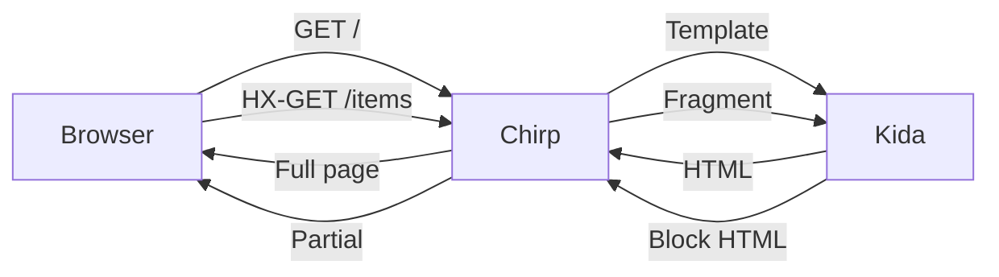

# Kitchen Sink: Extended Markdown Surfaces

Stress test of directive syntax using only extensions to existing markdown
constructs. No new top-level syntax. Every example must degrade readably in a
standard GitHub/VS Code markdown renderer.

---

## Tier 1: Inline — Link Syntax Extensions

### Icons

[*rocket]() [*warning]() [*check-circle]() [*arrow-right]()

Inline with text: Click [*rocket Launch]() to deploy your site.

### Badges / Chips

[^v2.1]() [^beta]() [^deprecated]() [^Python 3.14+]()

Mixed: This feature is [^beta]() and requires [^Python 3.14+]().

### Status indicators

[^!breaking]() [^~experimental]() [^+new]() [^-removed]()

### Inline icons with links (icon IS the link)

[*github](https://github.com/chirp) [*discord](https://discord.gg/chirp) [*docs](/docs)

### Keyboard shortcuts

[`Ctrl+K`]() [`Cmd+Shift+P`]() [`Esc`]()

### Variable references / interpolation

[=version]() [=last_updated]() [=author.name]()

Chirp [=version]() was released on [=release_date]().

---

## Tier 2: Block — Blockquote Extensions

### Alerts (GFM-compatible baseline)

> [!NOTE]
> This is already shipping in GitHub. We're not inventing anything here.

> [!WARNING]
> If this syntax is good enough for GitHub, it's good enough for us.

> [!TIP]
> The `[!TYPE]` pattern inside blockquotes is the proven extension point.

> [!CAUTION]
> This alert contains **bold**, `code`, and [links](https://example.com).
> It also spans multiple paragraphs.
>
> Second paragraph with a list:
> - First point
> - Second point
> - Third point with `code`

> [!IMPORTANT]
> Alerts can nest other markdown freely. That's the whole point.

### Alerts with code blocks

> [!NOTE]
> Install Chirp:
> ```bash
> pip install chirp
> uv add chirp
> ```
>
> Then verify:
> ```python
> import chirp
> print(chirp.__version__)
> ```

### Cards

> [!cards]
>
> [!card Getting Started]
> Learn the fundamentals of Chirp in under 5 minutes.
> Build your first hypermedia app with htmx.
> [Get started](/docs/intro) [*arrow-right]()
>
> [!card Templates]
> Kida templates power everything — pages, fragments,
> SSE payloads, and suspense shells from a single file.
> [Learn more](/docs/templates) [*arrow-right]()
>
> [!card Deployment]
> Freeze your app to static files, deploy to any CDN,
> or run as a live server with streaming.
> [Deploy now](/docs/deploy) [*arrow-right]()

### Cards with badges and multiple CTAs

> [!cards]
>
> [!card Chirp Core]
> [^stable]() [^v2.1]()
>
> The framework runtime. Routes, responses, middleware,
> and the intent-driven return type system.
>
> ```bash
> pip install chirp
> ```
>
> [Documentation](/docs) [GitHub](https://github.com/chirp) [Changelog](/changelog)
>
> [!card Kida Templates]
> [^stable]() [^v1.8]()
>
> High-performance template engine with block-level analysis,
> static introspection, and compile-time optimization.
>
> ```bash
> pip install kida-templates
> ```
>
> [Documentation](/docs/kida) [GitHub](https://github.com/kida) [Playground](/play)
>
> [!card Patitas Markdown]
> [^beta]() [^v0.4]()
>
> Markdown processor with first-class directive support,
> TOC generation, and front matter extraction.
>
> ```bash
> pip install patitas
> ```
>
> [Documentation](/docs/patitas) [GitHub](https://github.com/patitas)

### Tabs

> [!tabs]
>
> [!tab Python]
> ```python
> from chirp import App, Template
>
> app = App()
>
> @app.route("/")
> async def index():
>     return Template("index.html", title="Home")
> ```
>
> [!tab JavaScript]
> ```javascript
> import { createApp } from 'chirp-js'
>
> const app = createApp()
>
> app.get('/', () => {
>   return template('index.html', { title: 'Home' })
> })
> ```
>
> [!tab Go]
> ```go
> package main
>
> import "github.com/chirp/chirp-go"
>
> func main() {
>     app := chirp.New()
>     app.Get("/", func(c chirp.Context) error {
>         return c.Template("index.html", chirp.Map{"title": "Home"})
>     })
> }
> ```

### Tabs with mixed content (not just code)

> [!tabs]
>
> [!tab macOS]
> 1. Install Homebrew if you haven't: `/bin/bash -c "$(curl -fsSL ...)"`
> 2. Install uv: `brew install uv`
> 3. Create a project: `uv init myapp && cd myapp`
> 4. Add Chirp: `uv add chirp`
>
> > [!TIP]
> > On Apple Silicon, uv is significantly faster than pip.
>
> [!tab Linux]
> 1. Install uv: `curl -LsSf https://astral.sh/uv/install.sh | sh`
> 2. Create a project: `uv init myapp && cd myapp`
> 3. Add Chirp: `uv add chirp`
>
> > [!NOTE]
> > Requires Python 3.14+. Check with `python3 --version`.
>
> [!tab Windows]
> 1. Install uv: `powershell -c "irm https://astral.sh/uv/install.ps1 | iex"`
> 2. Create a project: `uv init myapp && cd myapp`
> 3. Add Chirp: `uv add chirp`
>
> > [!WARNING]
> > Windows support is experimental. WSL2 is recommended for production.

### Steps / Procedures

> [!steps]
>
> [!step Create the app]
> ```python
> from chirp import App
> app = App()
> ```
>
> [!step Add a route]
> Define your first route handler. The return type determines
> how Chirp renders the response.
>
> ```python
> @app.route("/")
> async def index():
>     items = await db.fetch_all()
>     return Template("index.html", items=items)
> ```
>
> [!step Create the template]
> ```html
> 
> 
>   <ul>
>     
>       <li>{{ item.name }}</li>
>     
>   </ul>
> 
> ```
>
> [!step Run it]
> ```bash
> chirp run app:app --reload
> ```
>
> Open `http://localhost:8000` in your browser. That's it.

### Accordions / Collapsible sections

> [!details How does Suspense work?]
> Suspense renders a shell immediately with skeleton placeholders,
> then streams resolved blocks as OOB swaps via SSE.
>
> ```python
> return Suspense("dashboard.html",
>     title="Dashboard",       # sync — in shell
>     stats=load_stats(),      # async — deferred
>     feed=load_feed(),        # async — deferred
> )
> ```
>
> The shell renders with deferred keys set to `None`. Templates use
> `` to toggle between skeleton and content.

> [!details What's the performance impact?]
> Zero overhead in normal serving. The ContextVar is `None` outside
> freeze, so `search_contribute()` is a no-op.
>
> | Scenario | Overhead |
> |----------|----------|
> | Normal serving | 0 ns |
> | Freeze without search | ~2 ns per route (ContextVar check) |
> | Freeze with search | ~50 μs per route (SearchEntry creation) |

### FAQ

> [!faq]
>
> [!q What Python versions are supported?]
> Python 3.14+ is required. We use the new `except X, Y:` syntax
> and other 3.14 features extensively.
>
> [!q Can I use Chirp without htmx?]
> Yes. Chirp works as a standard HTML framework. The htmx integration
> is opt-in — if no `HX-Request` header is present, routes return
> full pages automatically.
>
> [!q How does Chirp compare to FastAPI?]
> FastAPI is API-first (JSON responses, OpenAPI schemas). Chirp is
> hypermedia-first (HTML responses, template composition). They solve
> different problems.
>
> If you're building an SPA with a JSON API, use FastAPI.
> If you're building a server-rendered app with htmx, use Chirp.
>
> [!q Can I deploy to Vercel/Netlify?]
> Yes — `chirp freeze` generates static files that deploy anywhere.
> For dynamic features (SSE, Suspense), you need a server runtime.

### Nested blockquote directives (the hard case)

> [!cards]
>
> [!card Authentication]
> [^+new]() [^v2.1]()
>
> > [!tabs]
> >
> > [!tab Session]
> > ```python
> > app.config.secret_key = "..."
> > ```
> > Cookie-based sessions with CSRF protection.
> >
> > [!tab Token]
> > ```python
> > @app.middleware
> > async def auth(request, call_next):
> >     token = request.headers.get("Authorization")
> >     ...
> > ```
> > Bearer token auth for API endpoints.
>
> [!card Rate Limiting]
> [^beta]()
>
> > [!NOTE]
> > Requires `chirp[redis]` for distributed rate limiting.
>
> ```python
> @app.route("/api/submit", rate_limit="10/minute")
> async def submit():
>     ...
> ```

---

## Tier 3: Data — Code Fence Extensions

### Tables from data files

```table source=data/pricing.yaml
```

```table source=data/comparison.csv columns=name,chirp,nextjs,rails
```

### Charts

```chart:bar source=data/benchmarks.json
title: Requests per second
x: framework
y: rps
```

```chart:line source=data/adoption.csv
title: Monthly downloads
x: month
y: downloads
```

### API reference from code

```api source=src/chirp/app.py class=App
```

```api source=src/chirp/responses.py functions=Template,Fragment,Page,OOB
```

### Diagrams (mermaid is already a code fence extension)



### Import / Embed external content

```include path=examples/standalone/hello.py lines=1-15
```

```include path=CHANGELOG.md sections=v2.1
```

### Generated lists from collection data

```collection source=docs/guides/*.md
sort: metadata.order
template: card-list
filter: metadata.draft != true
```

```collection source=docs/api/*.md
sort: title
template: link-list
group_by: metadata.category
```

---

## Stress Tests: Real-World Complex Layouts

### Release notes page (cards + badges + tabs + alerts + code)

> [!cards]
>
> [!card v2.1.0 — Freeze & Search]
> [^+new]() [^2024-03-15]()
>
> Static site generation with render-time search indexing.
> Templates capture structured metadata during freeze — category,
> tags, TOC, description — without HTML scraping.
>
> > [!details What's included]
> > - `chirp freeze` command for static output
> > - Client-side search with faceted filtering
> > - `SearchEntry` dataclass + ContextVar capture
> > - DocsPlugin auto-contributes to search index
> > - Weighted scoring: title 5x, description 3x, body 1x
>
> > [!tabs]
> >
> > [!tab Upgrade]
> > ```bash
> > uv add chirp>=2.1.0
> > ```
> >
> > [!tab Breaking changes]
> > None. Fully backward compatible.
>
> [!card v2.0.0 — Suspense & Streaming]
> [^!breaking]() [^2024-01-20]()
>
> Deferred block rendering with automatic SSE streaming.
>
> > [!details Migration guide]
> > The `render_block()` signature changed:
> >
> > ```python
> > # Before (v1.x)
> > render_block(template, block_name, **ctx)
> >
> > # After (v2.0)
> > render_block(template, block_name, context=ctx)
> > ```
> >
> > See [full migration guide](/docs/migration/v2).

### Tutorial page (steps + tabs + alerts + code + FAQ)

> [!steps]
>
> [!step Install dependencies]
>
> > [!tabs]
> >
> > [!tab uv (recommended)]
> > ```bash
> > uv init chirp-tutorial && cd chirp-tutorial
> > uv add chirp[all]
> > ```
> >
> > [!tab pip]
> > ```bash
> > mkdir chirp-tutorial && cd chirp-tutorial
> > python -m venv .venv && source .venv/bin/activate
> > pip install 'chirp[all]'
> > ```
>
> [!step Create your app]
>
> Create `app.py`:
>
> ```python
> from chirp import App, Template, Fragment, Page
>
> app = App(template_dir="templates", debug=True)
>
> @app.route("/")
> async def index():
>     contacts = await load_contacts()
>     return Template("contacts.html", contacts=contacts)
>
> @app.route("/contacts/{id}")
> async def detail(id: int):
>     contact = await load_contact(id)
>     return Page("contacts.html", "detail", contact=contact)
> ```
>
> > [!TIP]
> > `Page()` automatically returns a fragment for htmx requests
> > and a full page for browser navigation. One route, both modes.
>
> [!step Create the template]
>
> Create `templates/contacts.html`:
>
> ```html
> 
>
> 
> <div id="contact-list">
>   
>     <a href="/contacts/{{ c.id }}"
>        hx-get="/contacts/{{ c.id }}"
>        hx-target="#detail">
>       {{ c.name }}
>     </a>
>   
> </div>
>
> 
> <div id="detail">
>   
>     <h2>{{ contact.name }}</h2>
>     <p>{{ contact.email }}</p>
>   
>     <p>Select a contact</p>
>   
> </div>
> 
> 
> ```
>
> [!step Run and test]
>
> ```bash
> chirp run app:app --reload
> ```
>
> Open http://localhost:8000. Click a contact — htmx swaps just the
> detail panel. Open in a new tab — full page renders. Same route,
> same template, zero JavaScript.
>
> > [!NOTE]
> > The `--reload` flag watches for file changes. In production,
> > omit it and use `--workers 4` for concurrency.

### Component showcase (cards with every possible inner element)

> [!cards]
>
> [!card DataTable Component]
> [^stable]() [^v1.2]() [*grid]()
>
> Sortable, filterable tables with server-side pagination.
> Zero JavaScript — uses htmx for sorting and page navigation.
>
> | Feature | Support |
> |---------|---------|
> | Sorting | [*check-circle]() Server-side |
> | Filtering | [*check-circle]() Per-column |
> | Pagination | [*check-circle]() Cursor-based |
> | Selection | [*check-circle]() Multi-row |
> | Export | [^beta]() CSV only |
>
> ```python
> return Template("page.html",
>     table=DataTable(
>         source=query,
>         columns=["name", "email", "role"],
>         page_size=25,
>     ),
> )
> ```
>
> > [!details Full API reference]
> >
> > ```api source=src/chirp/ext/tables.py class=DataTable
> > ```
>
> [Documentation](/docs/components/datatable)
>
> [!card CommandPalette Component]
> [^+new]() [^v2.1]() [*search]()
>
> Keyboard-driven command palette with fuzzy search.
> [`Cmd+K`]() to open. Alpine.js powered.
>
> > [!WARNING]
> > Requires `alpine=True` in AppConfig. See
> > [Alpine.js guide](/docs/guides/alpine) for setup.
>
> ```python
> app.config.alpine = True
> # CommandPalette auto-registers when alpine is enabled
> ```
>
> > [!tabs]
> >
> > [!tab Basic]
> > ```html
> > <div x-data="commandPalette">
> >   <!-- auto-injected by middleware -->
> > </div>
> > ```
> >
> > [!tab Custom actions]
> > ```python
> > palette.register("Toggle dark mode", action="/theme/toggle")
> > palette.register("New contact", action="/contacts/new")
> > ```
>
> [Documentation](/docs/components/command-palette)

---

## Degradation Test

Everything above this line should be **readable** (not pretty, but
readable) in any standard markdown renderer. The `[!TYPE]` labels
appear as text. Code blocks render normally. Links work. The document
is still a useful reference even without directive rendering.

**What a non-directive renderer shows:**
- `[*rocket]()` → a link with text "*rocket"
- `[^v2.1]()` → a link with text "^v2.1"
- `[!card Title]` → text "!card Title" inside a blockquote
- `[!tabs]` → text "!tabs" inside a blockquote
- `[!step Do the thing]` → text "!step Do the thing" inside a blockquote
- `` ```table source=... ``` `` → an empty code block with a weird language hint
- Nested blockquotes → deeper indentation, still readable

**What a directive-aware renderer shows:**
- Icons, badges, status chips rendered inline
- Card grids, tabbed interfaces, step wizards, accordions
- Data tables pulled from YAML/CSV sources
- Auto-generated API docs from Python source
- Embedded code snippets from external files

Same source file. Same git repo. Two experiences.

---

## Syntax Summary

### Inline (link extensions)

| Syntax | Meaning | Degrades to |
|--------|---------|-------------|
| `[*icon]()` | Icon | Link "*icon" |
| `[*icon](url)` | Icon link | Link "*icon" |
| `[*icon Text](url)` | Icon + text link | Link "*icon Text" |
| `[^label]()` | Badge/chip | Link "^label" |
| `[^!label]()` | Danger badge | Link "^!label" |
| `[^~label]()` | Warning badge | Link "^~label" |
| `[^+label]()` | Success badge | Link "^+label" |
| `[^-label]()` | Removed badge | Link "^-label" |
| `` [`keys`]() `` | Keyboard shortcut | Link "`keys`" |
| `[=var]()` | Variable interpolation | Link "=var" |

### Block (blockquote extensions)

| Syntax | Meaning | Degrades to |
|--------|---------|-------------|
| `> [!NOTE]` | Alert (GFM) | Blockquote |
| `> [!cards]` | Card container | Blockquote |
| `> [!card Title]` | Card item | Blockquote |
| `> [!tabs]` | Tab container | Blockquote |
| `> [!tab Label]` | Tab panel | Blockquote |
| `> [!steps]` | Step wizard | Blockquote |
| `> [!step Title]` | Step item | Blockquote |
| `> [!details Summary]` | Collapsible | Blockquote |
| `> [!faq]` | FAQ container | Blockquote |
| `> [!q Question?]` | FAQ item | Blockquote |

### Data (code fence extensions)

| Syntax | Meaning | Degrades to |
|--------|---------|-------------|
| `` ```table source=... `` | Data table | Empty code block |
| `` ```chart:type source=... `` | Chart | Code block |
| `` ```api source=... `` | API docs | Code block |
| `` ```include path=... `` | Embed file | Code block |
| `` ```collection source=... `` | Generated list | Code block |

---

## Open Questions

1. **Nesting depth** — Tabs inside cards inside steps technically works
   (deeper blockquote nesting) but gets unwieldy at 3+ levels. Is that
   a syntax problem or a content-design problem? (Probably the latter.)

2. **Inline badge semantics** — Is `[^v2.1]()` different from `[^v2.1]`
   (without parens)? Should bare `[^label]` work, or does the `()` serve
   as the "this is a directive, not a footnote" signal?

3. **Code fence parameters** — `source=`, `columns=`, `filter=` etc.
   are ad-hoc. Should there be a standard parameter syntax, or is
   freeform fine since each fence type defines its own?

4. **Collection queries** — `filter: metadata.draft != true` is a mini
   query language. How much power before we need a real query syntax?

5. **Composition with front matter** — Can front matter declare which
   directive types a page uses, enabling tree-shaking of the renderer?

```yaml
---
directives: [cards, tabs, badges]
---
```

6. **Template ownership** — In Chirp, the template decides rendering.
   Should directive type → template mapping be configurable?

```python
app.directive_templates = {
    "cards": "components/card-grid.html",
    "tabs": "components/tab-panel.html",
    "steps": "components/step-wizard.html",
}
```
