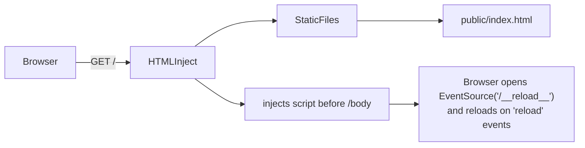

# Static Site Dev Server

A minimal static site served through chirp with live reload, demonstrating
the pattern for serving pre-built HTML/CSS/JS sites (like those generated
by Bengal or other static site generators).

## Features

- **Root-level StaticFiles** — serves `public/` at `/` with index resolution
- **HTMLInject middleware** — injects a live-reload `<script>` into every HTML page
- **SSE reload endpoint** — `/__reload__` streams reload events to connected browsers
- **Custom 404 page** — `public/404.html` served with status 404
- **No caching** — `Cache-Control: no-cache` for dev mode

## Run

```bash
python app.py
```

With pounce hot reload (watches for `.html` and `.css` changes too):

```bash
pounce examples.static_site.app:app --reload --reload-include ".html,.css"
```

## How It Works


