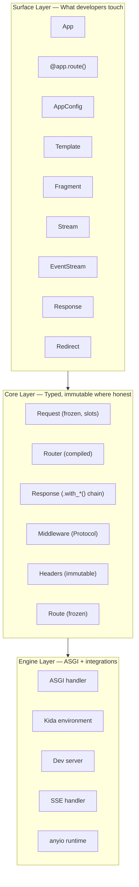
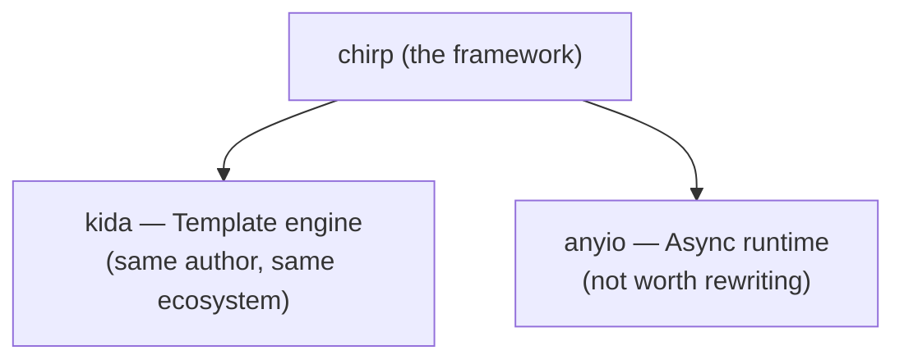

## Three Layers

Chirp is organized into three layers, each with a clear responsibility:



### Surface Layer

What developers interact with daily. Flask-familiar decorators, intuitive return types, and a frozen configuration dataclass. The surface is ergonomic -- you never need to understand the internals to use the framework.

### Core Layer

Typed, immutable data structures. `Request` is `@dataclass(frozen=True, slots=True)`. `Response` uses chainable `.with_*()` transformations. The router compiles to an immutable trie. Middleware follows a Protocol, not a base class.

### Engine Layer

The ASGI handler that translates between raw ASGI scope/messages and Chirp's typed abstractions. The kida environment for template rendering. The development server. This layer is internal -- developers rarely interact with it directly.

## Module Layout

```
chirp/
├── __init__.py          # Public API exports (lazy imports)
├── app.py               # App class
├── config.py            # AppConfig frozen dataclass
├── context.py           # Request-scoped context (ContextVar, g)
├── contracts.py         # Typed hypermedia contracts
├── errors.py            # Error hierarchy
├── sources.py           # Template source loading
│
├── _internal/           # ASGI type definitions (not public)
├── http/                # Request, Response, Headers, Cookies, Query, Forms
├── routing/             # Router, Route, path parameters
├── middleware/           # Protocol, CORS, StaticFiles, Sessions, Auth, CSRF
├── templating/          # Kida integration, return types, filters, streaming
├── realtime/            # SSE protocol and EventStream
├── server/              # ASGI handler, dev server, content negotiation
├── data/                # Database access, row mapping
├── security/            # Decorators, password hashing
├── testing/             # TestClient, assertions, SSE testing
├── tools/               # MCP tool registry and handler
├── validation/          # Form validation rules and results
└── ai/                  # LLM integration (optional)
```

## Request Flow

A request flows through the system like this:

1. **ASGI handler** receives raw scope and messages
2. **Request construction** -- frozen dataclass created from ASGI scope
3. **Middleware pipeline** -- each middleware wraps the next
4. **Router** -- trie lookup matches path to handler
5. **Handler invocation** -- signature introspection injects Request + params
6. **Return value** -- handler returns a value (Template, Fragment, etc.)
7. **Content negotiation** -- return type determines how to render the response
8. **Response sending** -- ASGI messages sent back to the server

## Dependencies

Chirp owns the developer interface and delegates commodity infrastructure:



Optional extras add focused capabilities without bloating the core:

```
chirp[forms]      → python-multipart  (form/multipart parsing)
chirp[sessions]   → itsdangerous      (signed session cookies)
chirp[auth]       → argon2-cffi       (password hashing)
chirp[testing]    → httpx             (test client)
chirp[data]       → aiosqlite        (SQLite)
chirp[data-pg]    → asyncpg          (PostgreSQL)
chirp[ai]         → httpx            (LLM streaming)
```

## Next Steps

- [[docs/about/philosophy|Philosophy]] -- Design principles
- [[docs/about/thread-safety|Thread Safety]] -- Free-threading patterns
- [[docs/core-concepts/app-lifecycle|App Lifecycle]] -- The freeze transition
