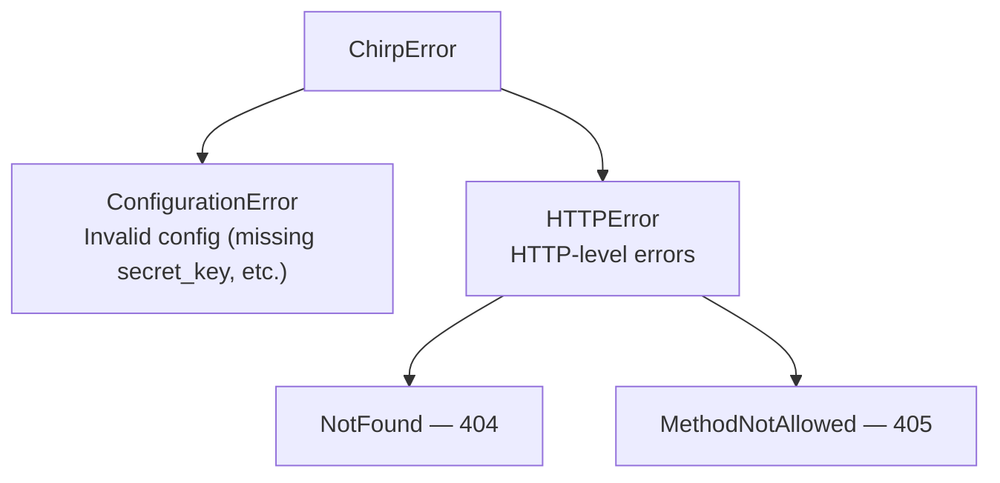

## Error Hierarchy



All Chirp exceptions inherit from `ChirpError`. HTTP errors carry a status code and detail message.

## Raising Errors

Raise HTTP errors in route handlers to trigger error responses:

```python
from chirp import NotFound, HTTPError

@app.route("/users/{id:int}")
async def get_user(id: int):
    user = await db.fetch_one("SELECT * FROM users WHERE id = ?", [id])
    if not user:
        raise NotFound(f"User {id} not found")
    return Template("user.html", user=user)

@app.route("/premium")
def premium():
    if not g.user or not g.user.is_premium:
        raise HTTPError(403, "Premium access required")
    return Template("premium.html")
```

### NotFound

```python
raise NotFound("Page not found")     # 404 with detail message
raise NotFound()                       # 404 with default message
```

### MethodNotAllowed

Raised automatically by the router when a path matches but the HTTP method does not. The response includes an `Allow` header listing valid methods and the allowed methods in the body.

### ConfigurationError

Raised at startup for invalid configuration:

```python
# These raise ConfigurationError:
# - Using SessionMiddleware without secret_key
# - Using CSRFMiddleware without secret_key
# - Returning Template without kida integration configured
```

## Error Handlers

Register custom error handlers by status code or exception type:

```python
@app.error(404)
def handle_404(request: Request):
    return Template("errors/404.html", path=request.path)

@app.error(500)
def handle_500(request: Request, error: Exception):
    return Template("errors/500.html", error=str(error))
```

Error handlers support the same return-value system as route handlers. You can return a `Template`, `Fragment`, `Response`, string, or dict.

### Handler Signatures

Error handlers support flexible signatures:

```python
# Zero arguments
@app.error(404)
def handle_404():
    return "Not Found"

# Request only
@app.error(404)
def handle_404(request: Request):
    return Template("404.html", path=request.path)

# Request and error
@app.error(500)
def handle_500(request: Request, error: Exception):
    log_error(error)
    return Template("500.html")
```

Chirp inspects the handler signature and injects the appropriate arguments.

### Exception Type Handlers

Handle specific exception types:

```python
from chirp import ValidationError

@app.error(ValidationError)
def handle_validation(request: Request, error: ValidationError):
    return Response(str(error)).with_status(422)
```

### Fragment-Aware Error Handling

When an htmx request triggers an error, Chirp renders error fragments instead of full error pages:

```python
@app.error(404)
def handle_404(request: Request):
    if request.is_fragment:
        return Fragment("errors/404.html", "error_message", path=request.path)
    return Template("errors/404.html", path=request.path)
```

Built-in error handling automatically returns `<div class="chirp-error">` snippets for htmx requests.

## Debug Pages

When `AppConfig(debug=True)`, unhandled exceptions render a detailed debug page with:

- Full traceback with source code context
- Request details (method, path, headers, query parameters)
- Application configuration

:::{warning}
Debug pages expose internal details. Never enable `debug=True` in production.
:::

## Next Steps

- [[docs/reference/api|API Reference]] -- Complete API surface
- [[docs/routing/routes|Routes]] -- Error handlers and route registration
- [[docs/core-concepts/configuration|Configuration]] -- Debug mode settings
