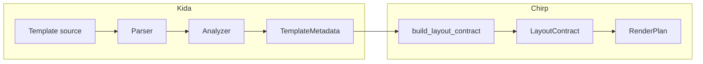

# Kida Integration

Chirp uses Kida's `template_metadata()` to introspect templates at build time.
Block names, regions, and dependencies come from the AST — Chirp never hard-codes
which blocks exist. That enables declarative OOB regions, block validation, and
layout contracts without framework-specific configuration.

## Overview



1. **Template source** → Kida parses and analyzes the AST
2. **TemplateMetadata** → Blocks, regions, `depends_on`, `cache_scope` per block
3. **build_layout_contract()** → Discovers `*_oob` blocks, extracts metadata
4. **LayoutContract** → Cached per template; drives OOB rendering on boosted navigation

## OOB Discovery

Chirp does not hard-code which blocks to render as OOB. Instead, it uses Kida's
`template_metadata()`:

1. `build_layout_contract()` calls `template_metadata()` on the root layout
2. Blocks named `*_oob` (or regions with that suffix) are identified as OOB candidates
3. Each block's `cache_scope` and `depends_on` from `BlockMetadata` determine
   rendering behavior:
   - `cache_scope: "site"` → skip (static, doesn't change per page)
   - `depends_on: {"page_title"}` → skip if `page_title` not in context
4. The `LayoutContract` is cached per template for efficiency

Adding new OOB regions requires only:

1. Add a `...` to the layout
2. Map the region name to a target DOM ID

ChirpUI pre-maps `breadcrumbs_oob`, `sidebar_oob`, and `title_oob` to
`chirpui-topbar-breadcrumbs`, `chirpui-sidebar-nav`, and `chirpui-document-title`.
For custom regions, use `custom_oob` → target `custom` (Chirp derives the target
from `block_name.removesuffix("_oob")`), or add an entry to `_OOB_TARGET_MAP` in
Chirp when using ChirpUI shell IDs.

## Block Validation

Before rendering a fragment, Chirp can validate that the requested block exists:

```python
# When validate_blocks=True (e.g. in development)
meta = adapter.template_metadata(view.template)
if view.block not in meta.blocks:
    raise KeyError(f"Block '{view.block}' not found in template '{view.template}'")
```

This uses `meta.blocks` from the AST — no runtime template loading needed for
validation.

## Regions

Kida's `` construct compiles to BOTH a block (for `render_block`)
AND a callable (for `{{ name(args) }}`). Use regions instead of separate blocks
and defs:

- **One definition** serves both app shell slots and OOB `render_block()`
- **Parameters** make regions self-contained: ``
- **Callable**: `{{ sidebar_oob(current_path=current_path | default("/")) }}` in slots
- **Renderable**: `render_block("sidebar_oob", current_path=...)` for OOB updates

Chirp uses `meta.regions()` when available to prefer region-typed blocks for OOB
discovery, falling back to the `*_oob` naming convention for plain blocks.

## Migrating from blocks to regions

If your layout uses `...` with duplicated content in
app shell slots, migrate to regions for a single definition:

**Before** — block + duplication in slots:

```html

{{ breadcrumbs(breadcrumb_items) }}



  
  {{ breadcrumbs(breadcrumb_items) }}  {# duplicated #}
  

```

**After** — region + call in slots:

```html

{{ breadcrumbs(breadcrumb_items) }}



  
  {{ breadcrumbs_oob(breadcrumb_items=breadcrumb_items | default([{"label":"Home","href":"/"}])) }}
  

```

**Checklist:**

1. Convert each `...` to `...`
2. Update app shell slots to call the region: `{{ name_oob(...) }}` instead of duplicating content
3. Remove redundant `_page_layout` empty block overrides — Chirp suppresses OOB on full-page via `block_overrides`

## Metadata Fields Used

| BlockMetadata field | Chirp use |
|--------------------|-----------|
| `blocks` | Block existence, OOB discovery |
| `regions()` | Prefer region-typed OOB blocks |
| `depends_on` | Skip OOB when required context missing |
| `cache_scope` | Future: cache page-level fragments |
| `is_region` | Filter to region blocks for OOB |
| `region_params` | (Reserved for call validation) |

## Adapter Contract

Chirp's `TemplateAdapter` protocol requires `template_metadata(template_name)`
returning an object with:

- `blocks`: `dict[str, BlockMetadata]` or `dict[str, Any]` with `cache_scope`,
  `depends_on` attributes
- `regions()`: optional; returns `dict[str, BlockMetadata]` of region blocks

The Kida adapter returns full `TemplateMetadata`. A Jinja2 adapter would return
`None`, and Chirp falls back to well-known ChirpUI OOB blocks.

## Next Steps

- [[docs/templates/fragments|Fragments]] — How Chirp finds blocks
- [[docs/guides/app-shell|App Shells]] — OOB regions in practice
- [Kida Framework Integration](https://lbliii.github.io/kida/docs/usage/framework-integration/) — Chirp as consumer
